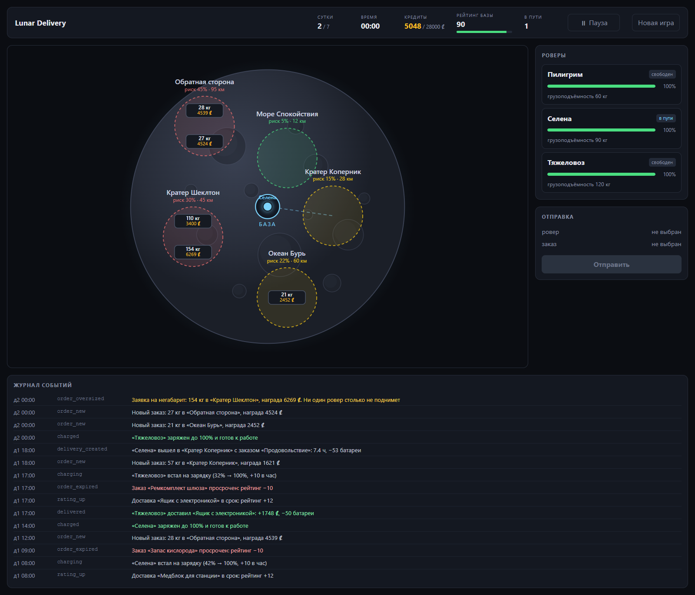
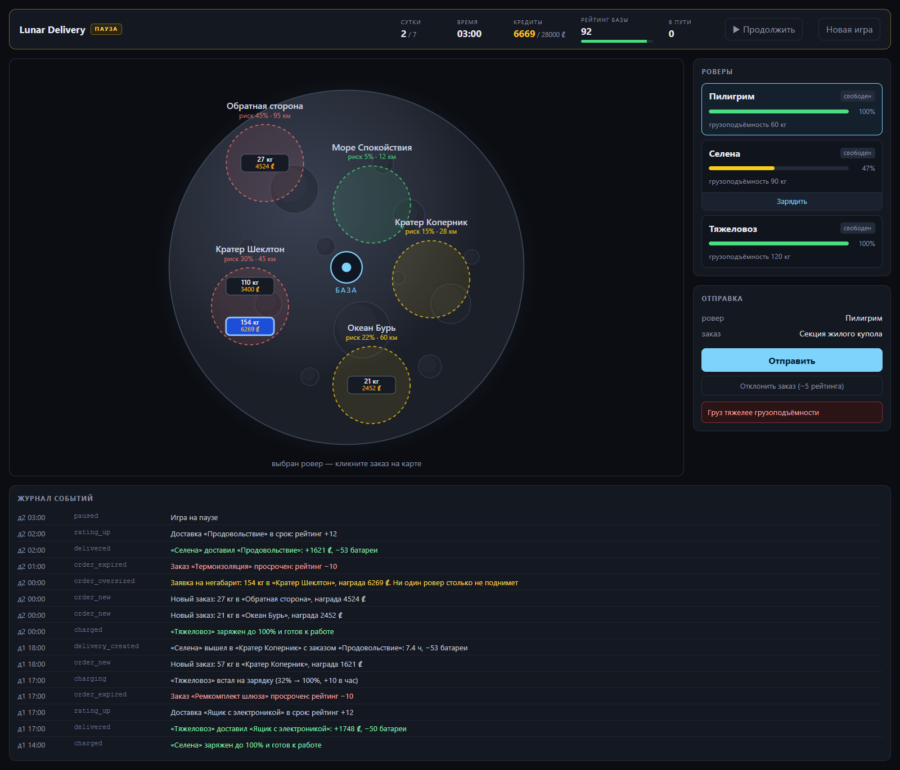
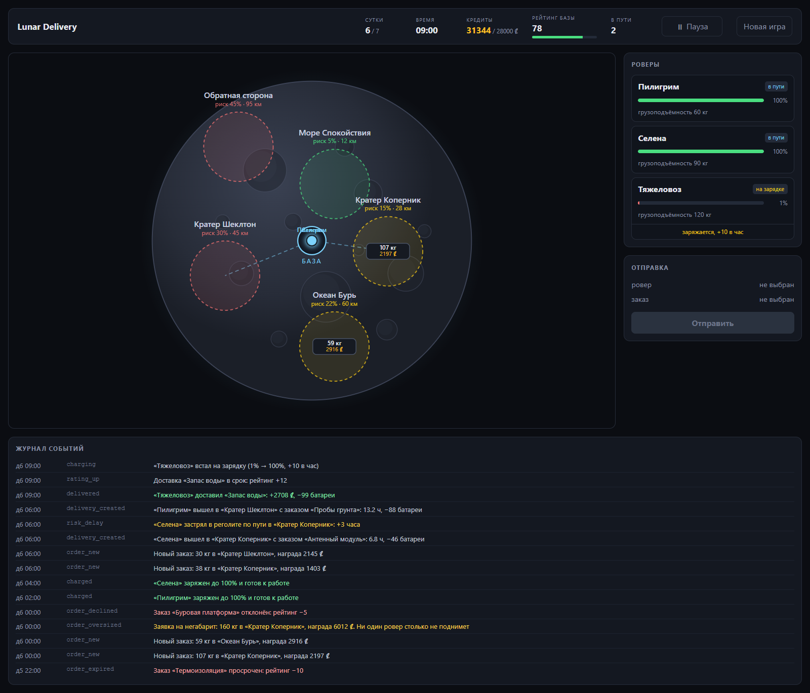
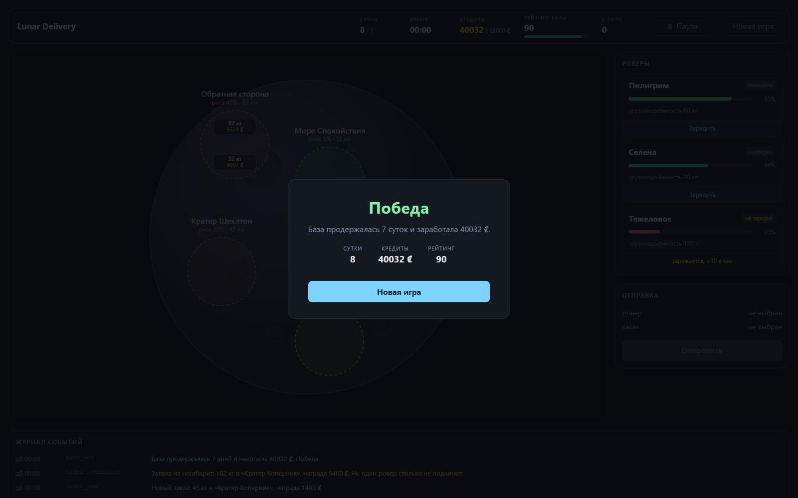

# Lunar Delivery

Браузерная игра про логистику на Луне. Вы диспетчер лунной базы: три ровера с разной
грузоподъёмностью, поток заказов и пять зон, у каждой своё расстояние, риск и проходимость.
Нужно решать, кого куда отправить, когда поставить ровер на зарядку, а какой заказ дешевле
отклонить, чем провалить.

**Цель** — продержаться 7 лунных суток и накопить 28 000 кредитов. **Поражение** — рейтинг
базы упал до нуля. Время идёт само, без вашего участия: заказы появляются и протухают, пока
вы думаете.



---

## Запуск

```bash
git clone https://github.com/Basiton/lunar-delivery.git
cd lunar-delivery
npm install
npm run dev
```

Откройте http://localhost:5173.

Нужен **Node.js 22 или новее** (этого требует `better-sqlite3`, на котором работает база).
Проверялось на Node 24. Ничего больше ставить не нужно: ни Python, ни компилятора, ни
отдельной СУБД — база это файл, он создастся сам при первом запуске.

`npm install` ставит зависимости обоих воркспейсов (`server` и `client`), `npm run dev`
поднимает одним процессом сервер на порту 3001 и клиент на 5173. Клиент ходит на
относительный `/api`, dev-сервер Vite проксирует эти запросы на Express — поэтому адрес
сервера нигде не зашит и нет CORS.

### Про `.npmrc`

В корне лежит `.npmrc` с одной строкой `ignore-scripts=true`, и она важна. `better-sqlite3` —
нативный модуль, но в пакете уже лежит готовый бинарник под нужную платформу (`prebuilds/`).
Несмотря на это, npm запускает его install-скрипт, тот зовёт `node-gyp` и требует Python:
на машине без Python установка падала целиком, вместе со всеми остальными пакетами.
Отключённые install-скрипты убирают лишнюю сборку, а готового бинарника достаточно.

Установка проверена из чистого клона в пустую папку: `npm install` без флагов проходит,
`npm run dev` поднимается, `/api/state` отвечает.

### Что где в репозитории

```
server/     Express + SQLite: игровой движок, API, симулятор баланса
client/     Vite + React: карта на SVG, панели, журнал событий
docs/       скриншоты для этого README
scripts/    вспомогательный скрипт, которым сняты скриншоты (к игре не относится)
```

`scripts/screenshots.mjs` оставлен в репозитории намеренно: по нему видно, что картинки ниже
сняты в живой игре, а не собраны руками. Он начинает партию, играет её через тот же HTTP API,
что и человек, и снимает настоящий интерфейс в headless-браузере. В зависимости игры он не
входит — чтобы его запустить, нужен отдельно поставленный `playwright`.

---

## Как играть

Выберите ровера в панели справа, затем кликните заказ на карте — заказ показан прямоугольником
с весом и наградой внутри своей зоны. Нажмите «Отправить»: ровер уйдёт в рейс и вернётся на
базу сам, награда придёт по возвращении. Если рейс невозможен, сервер откажет и напишет
причину — груз тяжелее грузоподъёмности, не хватит батареи или ровер занят. Севшему роверу
нажмите «Зарядить»: он заряжается на базе по +10 в час, заодно так чинят сломавшихся.
Заказ, который не поднимет ни один ровер, лучше отклонить сразу: −5 рейтинга дешевле, чем −10
за просрочку. Пауза — кнопка в шапке или **пробел**; на паузе часы стоят, а выбирать и
отправлять по-прежнему можно.



---

## Правила и формулы

### Игровое время

Один тик — 3 секунды реального времени — равен одному игровому часу, 24 часа складываются в
лунные сутки. Часы идут на сервере, поэтому не зависят от того, открыта ли вкладка. На паузе
тик пропускается целиком: заказы не протухают, новые не появляются, роверы стоят.

### Зоны

Зоны — константы в коде (`server/src/zones.js`), в базе они не хранятся; заказ ссылается на
зону по `zone_id`.

| Зона | Расстояние | Риск | Скорость |
|---|---|---|---|
| Море Спокойствия | 12 | 0.05 | 1.2 |
| Кратер Коперник | 28 | 0.15 | 1.0 |
| Кратер Шеклтон | 45 | 0.30 | 0.85 |
| Океан Бурь | 60 | 0.22 | 1.1 |
| Обратная сторона | 95 | 0.45 | 0.7 |

Расстояние — условные километры от базы, риск — вероятность происшествия в рейсе, скорость —
множитель проходимости (рельеф и освещённость). На карте зона окрашена по риску: зелёная — до
15 %, жёлтая — до 30 %, красная — выше.

### Расход батареи

Тратится тем больше, чем дальше зона, чем сильнее ровер загружен относительно своей
грузоподъёмности и чем опаснее маршрут. Полностью загруженный ровер тратит вдвое больше
пустого.

```
cost = distance × (1 + weight_kg / capacity_kg) × (1 + risk_factor)
```

Батарея списывается по возвращении, но проверяется при отправке: если расчётный расход больше
текущего заряда, рейс не начнётся.

### Время рейса

Базовая скорость — 10 условных единиц расстояния в игровой час, зона правит её своим
`speed_factor`. Загрузка замедляет ровер вдвое слабее, чем расходует батарею. Считается дорога
туда и обратно, поэтому результат удваивается.

```
time = distance / (10 × speed_factor) × (1 + 0.5 × weight_kg / capacity_kg)
рейс = time × 2
```

Рейс завершается, когда игровые часы доходят до `час старта + рейс + накопленные задержки`.

### Риск

В момент отправки бросается кубик: происшествие случается, если `Math.random() < risk_factor`.
Последствие выбирается случайно из трёх:

- **−20 батареи** — повреждена солнечная панель, ровер едет дальше;
- **+3 часа** — ровер застрял в реголите, рейс удлиняется;
- **поломка** — только в зонах с риском выше 0.3: ровер получает статус «повреждён», рейс
  провален, заказ возвращается в работу. Чинится зарядкой на базе.

### Рейтинг базы

Начинается со 100, не выходит за 0–100, ноль означает поражение.

| Событие | Рейтинг |
|---|---|
| доставка в срок (рейс закончился не позже дедлайна заказа) | **+12** |
| доставка с опозданием | без изменений |
| заказ протух, так и оставшись открытым | **−10** |
| заказ отклонён вручную | **−5** |

Прибавка на полном рейтинге сгорает — 100 это потолок.

### Заказы

Каждые 6 игровых часов появляются 1–2 новых заказа: случайная зона, вес 20–110 кг, срок
8–36 часов, награда считается от веса, расстояния и риска. Раз в сутки приходит негабарит
150–200 кг с наградой 6000–9000 ₡ — его не поднимет ни один ровер, и выбор стоит только между
«отклонить» (−5) и «дать протухнуть» (−10).



Журнал подсвечивает строки по типу события: зелёным — доставки и зарядка, жёлтым — риск и
заявка на негабарит, красным — потери рейтинга.

### Победа и поражение

**Победа** — прожить 7 полных суток (168 игровых часов) и иметь к этому моменту не меньше
28 000 кредитов. Если сутки уже седьмые, а кредитов не хватает, партия продолжается: победа
засчитается, как только счёт дойдёт до цели.

**Поражение** — рейтинг базы упал до нуля. Оно наступает сразу, в каком бы часу это ни
случилось.

Кредиты не тратятся: это счёт цели, а не ресурс.



---

## Что где хранится

SQLite через `better-sqlite3`, один файл — `server/data/lunar.db` (рядом лежат `-wal` и `-shm`,
потому что включён режим WAL). Файл создаётся сам при первом запуске и в репозиторий не
попадает; путь можно переопределить переменной `DB_PATH`. Статусы во всех таблицах ограничены
`CHECK`: в SQLite нет `ENUM`, а без ограничения опечатка в статусе легла бы в базу молча.

**`rovers`** — техника базы: `name`, `battery` (0–100), `capacity_kg` — грузоподъёмность,
`status` — `idle` / `delivering` / `charging` / `damaged`.

**`orders`** — заказы: `title`, `weight_kg`, `reward`, `deadline_hours` — срок в игровых часах
от появления, `zone_id` — ссылка на зону из кода, `created_hour` — игровой час появления,
`kind` — `normal` или `oversized`, `status` — `open` / `assigned` / `delivered` / `failed` /
`expired`. Отклонённый вручную заказ получает `failed`; отличить его от прочих можно по
событию `order_declined` в журнале.

**`deliveries`** — рейсы: `rover_id` и `order_id` — кто и что везёт, `started_hour` — игровой
час старта, `eta_hours` — длительность рейса туда-обратно, `delay_hours` — накопленные
задержки от происшествий, `battery_cost` — сколько спишется по возвращении, `status` —
`in_progress` / `done` / `failed`.

**`events`** — журнал: `type` (`delivered`, `risk_breakdown`, `order_expired`, …), `message` —
готовый текст для интерфейса, `rover_id` и `order_id` — к чему относится, `day` и `hour` —
игровое время события.

**`game_state`** — состояние партии, ровно одна строка (`CHECK (id = 1)`): `day`, `hour`,
`credits`, `rating`, `status` (`running` / `won` / `lost`) и `paused`. Пауза хранится здесь, а
не в браузере, иначе опрос сервера раз в две секунды сбрасывал бы её.

Клиент ничего не считает сам: раз в две секунды он забирает `GET /api/state` — состояние, зоны,
роверов, заказы, рейсы, последние события и блок `rules` с балансовыми числами, чтобы цифры в
интерфейсе не расходились с сервером.

| Метод | Путь | Назначение |
|---|---|---|
| `GET` | `/api/state` | всё состояние игры одним объектом |
| `POST` | `/api/deliveries` | отправить рейс (`rover_id`, `order_id`) |
| `POST` | `/api/rovers/:id/charge` | поставить ровер на зарядку |
| `POST` | `/api/orders/:id/decline` | отклонить заказ |
| `POST` | `/api/game/pause` | пауза: без тела переключает, с `{"paused": true}` ставит явно |
| `POST` | `/api/game/reset` | новая игра |

Отказы приходят кодом `422` и человеческой причиной, клиент показывает её как есть.

---

## Проверка баланса

Числа подобраны не на глаз. В `server/src/simulate.mjs` лежит симулятор: он играет партии тем
же движком, что и живая игра, — тот же `tick` и та же функция `startDelivery`, через которую
ходит HTTP-маршрут. Отличается только тот, кто нажимает кнопки: вместо человека жадная
стратегия без простоев (неподъёмное отклонить, свободному роверу отдать самый выгодный по
«награда за час» заказ, в который он успевает до дедлайна, иначе — на зарядку). Симулятор
работает на отдельном файле базы во временной папке и реальную партию не трогает.

```bash
npm run simulate --workspace server -- --runs 80
npm run simulate --workspace server -- --runs 80 --thresholds 25000,28000,30000,32000
BONUS_ON_TIME=10 npm run simulate --workspace server -- --runs 80
```

80 прогонов на текущих значениях:

| Показатель | Значение |
|---|---|
| дожили до седьмых суток | 62 из 80 (78 %) |
| победили (7 суток и 28 000 ₡) | **61 из 80 (76 %)** |
| кредиты у дошедших до финала | p10 29 413, медиана 33 883, максимум 41 521 |
| доставок за партию | 21 при 20 просроченных заказах |
| рейтинг на финише | медиана 59 |

Победа реальна, но не даётся сама, и за это отвечают две настройки.

**Бонус за доставку в срок 12** держит выживаемость. При `+10` до седьмых суток доходили
44 партии из 80 (55 %), при `+12` — 62 из 80 (78 %): просрочки съедают рейтинг быстрее, чем
доставки его возвращают, и двух очков разницы хватает, чтобы база не разваливалась после одной
неудачной серии.

**Цель 28 000 кредитов** срезает верх у выживших. Порог проверяется только на седьмых сутках и
на ход партии не влияет, поэтому кандидатов можно сравнивать по одной серии прогонов: 25 000 —
78 % побед (почти не отсекает тех, кто дожил), 28 000 — 76 %, 30 000 — 64 %, 32 000 — 53 %.
28 000 оставляет победу за большинством нормально сыгранных партий, но требует не простаивать.

Свои числа можно попробовать, не трогая код: `BONUS_ON_TIME`, `PENALTY_EXPIRED`,
`PENALTY_DECLINED`, `ORDER_EVERY_HOURS`, `CHARGE_PER_HOUR`, `WIN_CREDITS` и `TICK_MS` читаются
из переменных окружения и симулятором, и сервером.

---

## Ход разработки

Весь код проекта сгенерирован через Claude Code. Моя работа — декомпозиция на этапы, постановка
задач, чтение и проверка получившегося кода, отладка и решения по балансу. Игровые формулы и
схема базы спроектированы мной и переданы модели как спецификация: расчёт расхода батареи,
времени рейса, модель риска, состав таблиц и связи между ними — это проектные решения, а не
результат генерации. Значения бонуса за доставку в срок и цели по кредитам приняты по итогам
прогонов симулятора, а не по ощущениям.

Отдельная история — установка. Пока работаешь в своей папке, `npm install` проходит, и это
ничего не значит: проверка из чистого клона на машине без Python показала, что установка падает
целиком — не ставится ни один пакет. Причина оказалась не в коде проекта: `better-sqlite3`
привозит в пакете готовый бинарник, но npm всё равно запускает его install-скрипт, а тот
пытается собрать модуль через `node-gyp` и требует Python. Лечится одной строкой в `.npmrc`
(`ignore-scripts=true`) — собирать нечего, бинарник уже есть. После этого клон в пустую папку и
`npm install` без флагов были повторены заново, до отвечающего `/api/state`.

Скриншоты в этом README сняты так же честно: `scripts/screenshots.mjs` начинает новую партию,
играет её через публичный API — отправляет рейсы, ставит роверов на зарядку, отклоняет
негабарит — и снимает настоящий интерфейс в браузере. Ни одна строка в базе руками не
правилась, поэтому на картинках ровно то, что увидит игрок.
