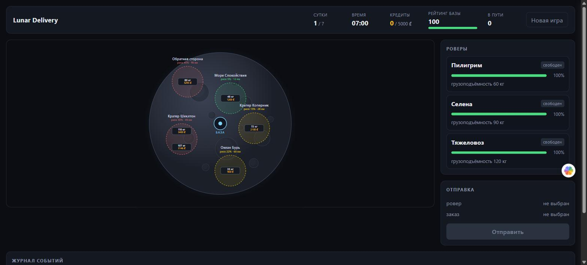
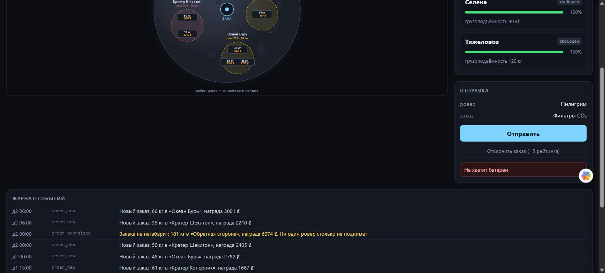
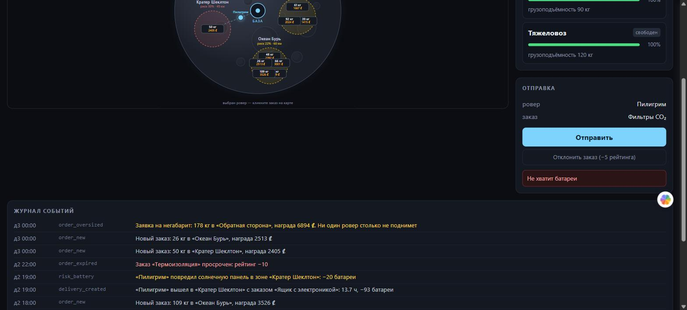
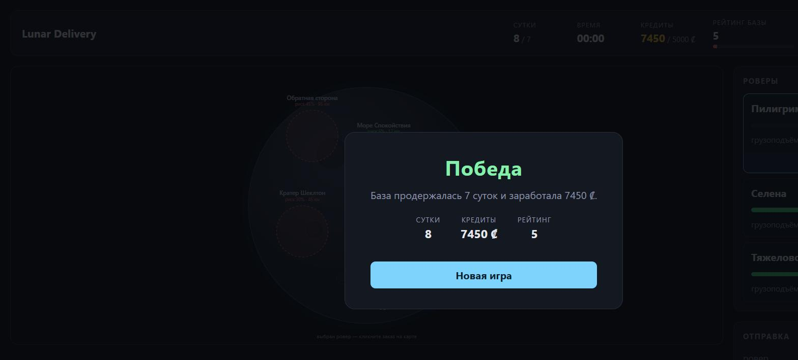

# Lunar Delivery — игровой симулятор лунной доставки

Браузерная игра про логистику на Луне. Вы — диспетчер лунной базы: у вас три ровера
с разной грузоподъёмностью и поток заказов в пять зон, каждая со своим расстоянием,
риском и проходимостью. Нужно решать, кого куда отправить, когда ставить ровер на
зарядку, а какой заказ выгоднее отклонить, чем провалить.

**Цель:** продержаться 7 лунных суток и накопить 28 000 кредитов.
**Поражение:** рейтинг базы падает до нуля.

Время идёт само: один тик раз в 3 секунды реального времени равен одному игровому
часу, 24 часа — лунные сутки. Заказы появляются и протухают независимо от того,
смотрите вы на экран или нет.



---

## Как запустить

```bash
npm install
npm run dev
```

Первая команда ставит зависимости всех воркспейсов, вторая поднимает сервер
(`http://localhost:3001`) и клиент (`http://localhost:5173`) одним процессом через
`concurrently`. Откройте `http://localhost:5173`.

База данных создаётся автоматически при первом запуске и засевается стартовым
состоянием: три ровера и четыре заказа. Кнопка «Новая игра» в шапке сбрасывает
всё обратно к сиду.

Требуется Node.js 22 или новее (`better-sqlite3` и `concurrently` не поддерживают
более старые версии).

---

## Правила

### Зоны

Зоны — константы в коде (`server/src/zones.js`), в базе не хранятся.

| Зона | Расстояние | Риск | Скорость |
|---|---|---|---|
| Море Спокойствия | 12 | 0.05 | 1.2 |
| Кратер Коперник | 28 | 0.15 | 1.0 |
| Кратер Шеклтон | 45 | 0.30 | 0.85 |
| Океан Бурь | 60 | 0.22 | 1.1 |
| Обратная сторона | 95 | 0.45 | 0.7 |

На карте зона окрашена по риску: зелёная — до 15%, жёлтая — до 30%, красная — выше.

### Расход батареи

Чем дальше зона, чем сильнее загружен ровер относительно своей грузоподъёмности и
чем опаснее маршрут — тем больше расход. Полностью загруженный ровер тратит вдвое
больше, чем пустой.

```
cost = distance * (1 + weight_kg / capacity_kg) * (1 + risk_factor)
```

Батарея списывается по возвращении, но проверяется при отправке: если расчётный
расход больше текущего заряда, рейс не начнётся.

### Время доставки

Базовая скорость — 10 условных единиц расстояния в час, зона её корректирует своим
`speed_factor`. Загрузка замедляет ровер вдвое слабее, чем расходует батарею.
Рейс считается туда и обратно, поэтому время удваивается.

```
time = distance / (10 * speed_factor) * (1 + 0.5 * weight_kg / capacity_kg)
рейс = time * 2
```

### Риск

В момент отправки бросается кубик: `Math.random() < risk_factor`. Если выпало
происшествие, случайно выбирается одно из последствий:

- **потеря 20 батареи** — ровер продолжает рейс с повреждённой панелью;
- **задержка +3 часа** — ровер застрял в реголите;
- **поломка** — только в зонах с `risk_factor > 0.3`: ровер получает статус
  `damaged`, доставка проваливается, заказ возвращается в работу.

Повреждённый ровер возвращается в строй через зарядку.

### Кредиты

- Доставленный заказ: `+reward` кредитов. Награда растёт от веса, расстояния и риска.
- Кредиты не тратятся: это счёт цели, а не ресурс.

### Рейтинг базы

Рейтинг начинается со 100, ограничен диапазоном 0–100, и ноль означает поражение.

| Событие | Рейтинг |
|---|---|
| Доставка в срок (рейс закончился не позже дедлайна) | `+10` |
| Доставка с опозданием | без изменений |
| Заказ протух в статусе `open` | `−10` |
| Заказ отклонён вручную | `−5` |

Прибавка на полном рейтинге сгорает: 100 — это потолок. Отклонить неподъёмный
заказ вдвое дешевле, чем дать ему протухнуть, — в этом и состоит выбор.

### Прочее

- Зарядка: `+10` батареи за игровой час, до 100. Заряжать можно только ровер на базе;
  ему же зарядка снимает статус `damaged`.
- Каждые 6 игровых часов появляются 1–2 новых заказа со случайными параметрами.
- Раз в сутки приходит негабарит 150–200 кг с наградой 6000–9000 ₡. Его не поднимет
  ни один ровер: остаётся отклонить (`−5`) или дать протухнуть (`−10`).

### Пауза

Кнопка в шапке или клавиша **пробел**. На паузе игровые часы стоят, заказы не
протухают и не появляются, роверы на карте замирают. При этом выбирать ровер и
заказ можно, и отправить рейс тоже можно — он стартует с текущего игрового часа
и тронется, как только паузу снимут. Состояние паузы хранится на сервере в
`game_state`, поэтому поллинг и перезагрузка вкладки её не сбрасывают.

### О балансе

Числа подобраны симулятором, а не на глаз. Стратегия в симуляции — жадная и без
простоев: три ровера всегда чем-то заняты, неподъёмное отклоняется сразу, берётся
самый выгодный по «награда за час» заказ, в который ровер успевает до дедлайна.

На 120 прогонах с текущими значениями:

| Показатель | Значение |
|---|---|
| дожили до седьмых суток | 64% |
| победили (7 суток и 28 000 ₡) | 63% |
| кредитов у дошедших до финала | 29–42 тыс., медиана ≈ 34 тыс. |
| доставок за партию | ≈ 20 |

Победа реальна, но не гарантирована. Ограничивает её выживаемость, а не деньги:
цель в 28 000 ₡ отсекает лишь худшие партии, а всё остальное решает рейтинг.
Поднять долю побед до 75% можно только смягчением рейтинговой экономики —
например, `BONUS_ON_TIME=12` даёт 78% выживаемости и 73% побед при той же цели.

Проверить и подобрать свои числа можно, не трогая код:

```bash
npm run simulate --workspace server -- --runs 40
npm run simulate --workspace server -- --runs 40 --thresholds 25000,28000,30000
BONUS_ON_TIME=12 npm run simulate --workspace server -- --runs 40
```

Флаг `--thresholds` оценивает кандидатов на цель по кредитам одной серией прогонов:
порог победы не влияет на ход партии, потому что проверяется только на седьмых сутках.

Переменные `BONUS_ON_TIME`, `PENALTY_EXPIRED`, `PENALTY_DECLINED`, `ORDER_EVERY_HOURS`,
`CHARGE_PER_HOUR` и `WIN_CREDITS` читает и сервер, так что запустить игру с другим
балансом можно тем же способом.

---

## Хранение данных

SQLite через `better-sqlite3`, файл `server/data/lunar.db` (создаётся автоматически,
в репозиторий не попадает). Режим WAL, внешние ключи включены. Статусы во всех
таблицах ограничены `CHECK` — SQLite не знает `ENUM`, а без ограничения опечатка в
статусе легла бы в базу молча.

### `rovers` — техника базы

| Колонка | Тип | Смысл |
|---|---|---|
| `id` | INTEGER PK | |
| `name` | TEXT | имя ровера |
| `battery` | INTEGER | заряд 0–100 |
| `capacity_kg` | REAL | грузоподъёмность |
| `status` | TEXT | `idle` / `delivering` / `charging` / `damaged` |
| `updated_at` | TEXT | момент последнего изменения |

### `orders` — заказы

| Колонка | Тип | Смысл |
|---|---|---|
| `id` | INTEGER PK | |
| `title` | TEXT | название груза |
| `weight_kg` | REAL | вес |
| `reward` | INTEGER | награда в кредитах |
| `deadline_hours` | REAL | срок в игровых часах от появления |
| `zone_id` | TEXT | ссылка на зону из кода |
| `status` | TEXT | `open` / `assigned` / `delivered` / `failed` / `expired` |
| `created_hour` | INTEGER | игровой час появления |
| `kind` | TEXT | `normal` / `oversized` |
| `created_at` | TEXT | реальное время создания |

Отклонённый заказ получает статус `failed`; причина различима по событию
`order_declined` в журнале.

### `deliveries` — рейсы

| Колонка | Тип | Смысл |
|---|---|---|
| `id` | INTEGER PK | |
| `rover_id` | INTEGER FK | кто везёт |
| `order_id` | INTEGER FK | что везёт |
| `started_hour` | INTEGER | игровой час старта |
| `eta_hours` | REAL | длительность рейса туда-обратно |
| `delay_hours` | REAL | накопленная задержка от происшествий |
| `battery_cost` | INTEGER | сколько спишется по возвращении |
| `status` | TEXT | `in_progress` / `done` / `failed` |
| `started_at` | TEXT | реальное время старта |

Рейс завершается, когда игровые часы доходят до `started_hour + eta_hours + delay_hours`.

### `events` — журнал

| Колонка | Тип | Смысл |
|---|---|---|
| `id` | INTEGER PK | |
| `type` | TEXT | `delivered`, `risk_breakdown`, `order_expired`, … |
| `message` | TEXT | текст для журнала |
| `rover_id`, `order_id` | INTEGER FK | к чему относится, может быть пусто |
| `day`, `hour` | INTEGER | игровое время события |
| `created_at` | TEXT | реальное время |

### `game_state` — состояние партии

Ровно одна строка, `CHECK (id = 1)`.

| Колонка | Тип | Смысл |
|---|---|---|
| `day` | INTEGER | игровые сутки, с 1 |
| `hour` | INTEGER | час 0–23 |
| `credits` | INTEGER | накоплено кредитов |
| `rating` | INTEGER | рейтинг базы 0–100 |
| `status` | TEXT | `running` / `won` / `lost` |
| `paused` | INTEGER | 1 — часы стоят |

---

## API

| Метод | Путь | Назначение |
|---|---|---|
| `GET` | `/api/state` | всё состояние игры одним объектом |
| `POST` | `/api/deliveries` | отправить рейс (`rover_id`, `order_id`) |
| `POST` | `/api/rovers/:id/charge` | поставить ровер на зарядку |
| `POST` | `/api/orders/:id/decline` | отклонить заказ |
| `POST` | `/api/game/pause` | пауза; без тела переключает, с `{"paused":true/false}` ставит явно |
| `POST` | `/api/game/reset` | новая игра |

Отказы приходят с кодом `422` и человекочитаемой причиной: «Груз тяжелее
грузоподъёмности», «Не хватит батареи», «Ровер занят». Клиент показывает текст как
есть.

---

## Как это выглядит

Отказ приходит с сервера и показывается как есть — здесь ровер с зарядом 5%
не тянет рейс, которому нужно 19.5:



Журнал подсвечивает происшествия: жёлтым — риск и негабарит, красным — потери:



Экран победы после семи суток:



---

## AI в разработке

Весь код проекта сгенерирован через Claude Code.

Мой вклад — постановка задач, декомпозиция работы на этапы, чтение и проверка
получившегося кода, отладка и доведение до рабочего состояния. Игровые формулы и
схема базы данных спроектированы вручную и переданы модели как спецификация:
расчёт расхода батареи, времени рейса, модель риска, состав и связи таблиц — это
проектные решения, а не результат генерации.
